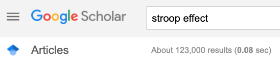
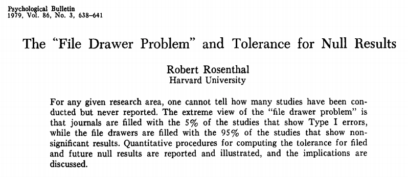
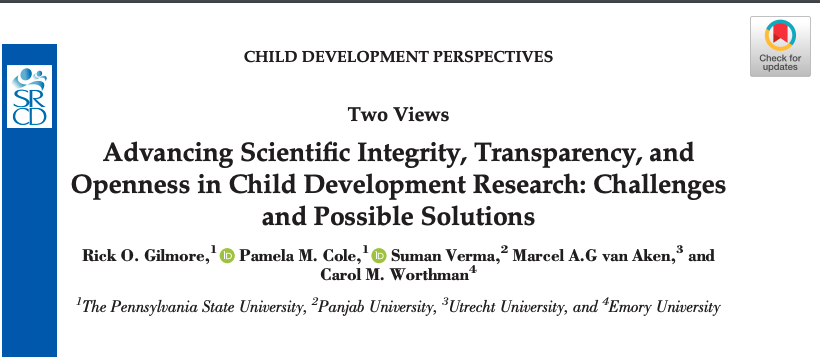
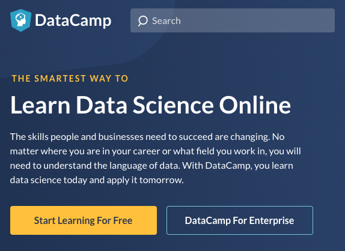

```{r setup, include=FALSE}
knitr::opts_chunk$set(echo = FALSE,
                      fig.align = "center")
```

# Preliminaries

## Agenda

- Aspirations, realities, & behavior change
- Databrary
- Toward a more perfect workflow
- Why R?
- How R

# Aspirations, realities, & behavior change

---

<iframe width="560" height="315" src="https://www.youtube.com/embed/66oNv_DJuPc" frameborder="0" allow="accelerometer; autoplay; encrypted-media; gyroscope; picture-in-picture" allowfullscreen></iframe>

<https://www.youtube.com/embed/66oNv_DJuPc>

---

```{r, echo=FALSE, fig.align='center'}
knitr::include_graphics("https://mathshistory.st-andrews.ac.uk/Biographies/Feynman/thumbnail.jpg")
```

> "*The first principle is that you must not fool yourself, and you are the easiest one to fool.*"
</br>-- Richard P. Feynmann

---

```{r}
knitr::include_graphics("https://www.rd.com/wp-content/uploads/2017/02/01-How-Bad-is-it-to-Share-a-Toothbrush-159311405-ABykov-760x506.jpg")
```

---

> "*...psychologists tend to treat other peoples’ theories like toothbrushes; no self-respecting individual wants to use anyone else’s.*"
</br>
</br>[Mischel, 2009](https://www.psychologicalscience.org/observer/becoming-a-cumulative-science)</small>

---

> "*The toothbrush culture undermines the building of a genuinely cumulative science, encouraging more parallel play and solo game playing, rather than building on each other’s directly relevant best work.*"
</br>
</br>
[Mischel, 2009](https://www.psychologicalscience.org/observer/becoming-a-cumulative-science)

## Open science accelerates discovery

- Shows your work
- Data + analysis code + tasks
- What's the effect size for...
</br>

```{r, out.width='600px'}

```

## Closed science *slows* discovery

- Wastes energy, time, money
- Hasn't somebody tried X before?
- How big is the 'file drawer effect'?

---

```{r, out.width='900px', fig.cap='[[@Rosenthal1979-zi]](https://doi.org/10.1037/0033-2909.86.3.638)'}

```

## Open science strengthens inference

- Improves reproducibility
- Reveals errors faster
- Permits verification, re-analysis; strengthens meta-analysis
- Boosts sample sizes & increases power

## Closed science *weakens* inference {.smaller}

<div class="centered">
```{r, out.width="900px", fig.align='center'}
knitr::include_graphics("https://journals.plos.org/plosbiology/article/file?id=10.1371/journal.pbio.2000797.g003&type=large")
```

[[@Szucs2017-fc]](https://doi.org/10.1371/journal.pbio.2000797)
</div>

## Yes, but...

- Sharing difficult, time-consuming
- Openness not yet rewarded, highly valued
- Collecting new data better (for me) than cleaning-up finished studies to share them
- I'll share with X but not with Y

---

- I'll change when.. 
    - the field does/I get tenure/I'm finished with my data...
- I can't share because...
    - I don't have permission from IRB/participants/collaborators
- I own my data...
    - don't I?
    
---

```{r, fig.cap='[[@Gilmore2020-sl]](http://dx.doi.org/10.1111/cdep.12360)', out.width='800px'}

```

# Databrary.org

---

<iframe src="https://nyu.databrary.org" height=600px width=1000px>
</iframe>

---

```{r}
db_stats <- databraryapi::get_db_stats()
```

- World's only data library specialized for storing and sharing video and audio + <span color="red">related data</span> from research on humans
- Hosted at New York University
- Opened 2014
- `r db_stats$institutions` institutions; `r db_stats$investigators + db_stats$affiliates` researchers; `r format(db_stats$hours, digits = 5, decimal.mark=".", big.mark=",", small.mark=".", small.interval=2)` hours of video + other data; `r db_stats$datasets_shared` shared projects

## Video and audio data pose special risks

- Faces & voices
- Names, personal locations
- Behaviors

## Video data have unique research potential

as **data**...

- Spatially & temporally dense samples of behavior
- "Outputs" of biological processes

[[@Adolph_KE_Gilmore_RO_Kennedy_JL2017-va]](https://www.apa.org/science/about/psa/2017/10/video-data)

---

and as **documentation**...

- How procedures are [actually done](https://www.play-project.org/collection.html)
- What computer-based [tasks](https://nyu.databrary.org/volume/31) actually look or sound like

[[@Gilmore2017-wd]](https://doi.org/10.1038/s41562-017-0128)

---

```{r, fig.cap='[[@Mota]](http://doi.org/10.17910/B7.272)', out.width='900px'}
knitr::include_graphics("https://nyu.databrary.org/slot/14554/-/asset/61306/download?inline=true")
```

## How Databrary protects personal data

- Shared only with participant permission (& IRB approval)
- Provide [template language](https://www.databrary.org/support/irb/release-template.html), [scripts](https://www.databrary.org/support/irb/script.html) and [procedure documentation](https://www.databrary.org/video/example-video-1.mp4)

## Share openly (but with restricted audiences)

- Researchers require institutional authorization
- [Formal access agreement](https://www.databrary.org/about/agreement.html)
- Site-wide access, not dataset-specific
- Generic research uses
- **Not limited to video & audio!**

---


| asset_type |	total_files |
|------------|--------------|
| Datavyu	| 2314 |
| CSV |	1743 |
| PNG |	1439 |
| CHAT |	314 |
| TXT | 278 |
| Excel | 191 |
| SPSS | 16 |

<!-- ## Virtues -->

<!-- - Restricted data sharing has long track-record (e.g., [ICPSR](https://www.icpsr.umich.edu/)) -->
<!-- - Consistent [sharing permission](https://www.databrary.org/support/irb/release-levels.html) clarifies nature of risk -->
<!-- - Empowers participants -->
<!-- - Researchers & institutions determine what to share & when -->

<!-- --- -->

<!-- - Open, but not public, sharing -->
<!-- - More secure than public data and materials services or journal web pages -->
<!-- - Researchers, Institutions need not reinvent wheels -->
<!-- - More discoverable than personal websites or institutional repositories -->
<!-- - Allows smaller-scale programs of research to contribute -->

<!-- --- -->

<!-- - Consistent curation (and [sharing permissions](https://www.databrary.org/support/irb/release-levels.html)) make reuse easier -->
<!-- - Works for data beyond video -->
<!-- - Secure data interaction via API -->

## Access data via reproducible API commands

```{r, echo=TRUE}
databraryapi::get_db_stats()
```

[[@databraryapi]](https://play-behaviorome.github.io/databraryapi/)

# Toward a more perfect workflow

## Best practices

- Reproducibility, transparency, and openness ->
- Robust findings & accelerated discovery
    
## What's reproducibility?

## *Methods* reproducibility

- Enough details about materials & methods recorded (& reported)
- Same results with same materials & methods

<small>[Goodman et al., 2016](http://doi.org/10.1126/scitranslmed.aaf5027)</small>

---

<div class="centered">

</div>
<div class="notes">
I like to call this the "hit by a truck" scenario.
</div>

## *Results* reproducibility

- Same results from independent study

<small>[Goodman et al., 2016](http://doi.org/10.1126/scitranslmed.aaf5027)</small>

## *Inferential* reproducibility

- Same inferences from one or more studies or reanalyses

<small>[Goodman et al., 2016](http://doi.org/10.1126/scitranslmed.aaf5027)</small>

## What's a reproducible workflow?

- Data in interoperable formats (.txt or .csv)
- Scripted, automated == minimize human-dependent steps
- Well-documented
- Kind to your future (forgetful) self
- Transparent to me & colleagues == transparent to others

# Why R?

## Aspirations & Philosophy

- You **can** learn to program
- You **should** learn to program
- R is a good language for learning programming
    - Especially if you work with data
- R makes it easy to produce open, transparent, & reproducible workflows

## The Story of R

- What is R?
    - Programming language written by and for statisticians and data scientists

---

- Why is it called R?
    - TLDR: it’s the free, open-source version of a commercial program called S developed in the 1970s at Bell Labs
    - Bell Labs is also the home of C, and the Unix operating system
- Core language + 1,000s of packages

## The storRy of R

```{r, fig.cap='https://www.amazon.co.uk/Story-R-Gaia-Servadio/dp/0330332031'}
knitr::include_graphics("https://images-na.ssl-images-amazon.com/images/I/41ZHVS1JSHL._SX293_BO1,204,203,200_.jpg")
```

## The Story of R

- Features of R
    - Written in C, Fortran, and R
    - [9th most popular](https://www.tiobe.com/tiobe-index/) programming language
    - Base R (now 4.0.2) + thousands of packages
    - Object-oriented
        - `my_plot <- hist(rnorm(n=100, mean=0, sd=1))`
        
---

```{r}
(my_plot <- hist(rnorm(n=1000, mean=0, sd=1)))
```

## What is RStudio

- Integrated Development Environment (IDE) for using R.
    - Editor
    - Console
    - Version control
    - Help
- Free + paid versions
- Install on local computer or use [PSU's cloud](https://lxclusterapps.tlt.psu.edu:8787/)

# How R?

## Psychology Department Resources

- <https://github.com/psu-psychology>
- <https://psu-psychology.github.io/psy-525-reproducible-research-2020/>
- <https://psu-psychology.github.io/r-bootcamp-2019/>
    - [Slow-R](https://psu-psychology.github.io/r-bootcamp-2019/talks/slow-r.html)
    - [R-eproducible Science](https://psu-psychology.github.io/r-bootcamp-2019/talks/r-eproducible-science.html)
- <https://psu-psychology.github.io/r-bootcamp-2018>

## DataCamp

```{r, fig.cap='https://datacamp.com', out.width='600px'}

```

# Let's open (& strengthen) psychological science

## Share our own data and materials

- [Databrary](https://databrary.org)
  - Data that should be restricted
  - Start with procedure videos, displays
- [Open Science Framework (OSF)](https://osf.io)
- [OpenNeuro](https://openneuro.org)

## Write and share reproducible analysis & display code

- [Psychophysics Toolbox](https://psychtoolbox.org), [Psychopy](https://psychopy.org), E-Prime
- [Github](https://github.com), [Gitlab](https://gitlab.com)
- MATLAB, R, Python, shell scripts; but also SPSS, SAS, ...

## Change the scientific culture...

- Reuse shared data
- Cite colleagues' data & materials
  - e.g., [[@r-lang]](https://www.R-project.org/); [[@rmarkdown-bk]](https://bookdown.org/yihui/rmarkdown); [[@rmarkdown-pkg]](rmarkdown-pkg); [[@databraryapi]](http://github.com/PLAY-behaviorome/databraryapi)
- Add open science contributions to our websites, CVs, etc.
- Urge professional societies and journals to adopt open science policies, e.g.  [[@Srcd2019-hg]](https://www.srcd.org/policy-scientific-integrity-transparency-and-openness)

## Use video 

- to document and share procedures
- to capture and describe a broader range of participants' behaviors

## You R ready to do it!

<div class="centered">
</br>
rog1\@psu.edu</br></br>
gilmore-lab.github.io</br></br>
github.com/gilmore-lab
</div>

# Resources

## Software

<!-- Scrolling slides -->
<!-- http://stackoverflow.com/q/38260799 -->
<style>
slides > slide { overflow: scroll; }
slides > slide:not(.nobackground):before {
  background: none;
  }
slides > slide:not(.nobackground):after {
  content: '';
  background: none;
  }
}
</style>

This talk was produced on `r Sys.Date()` in [RStudio](http://rstudio.com) using R Markdown.
The code and materials used to generate the slides may be found at <https://github.com/gilmore-lab/2020-10-07-why-r>.
Information about the R Session that produced the code is as follows:
```{r session-info}
sessionInfo()
databraryapi::logout_db()
```

## References {.smaller}